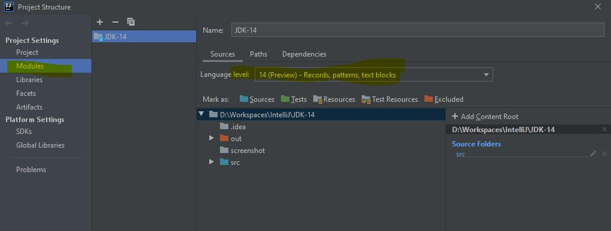

New features of JDK 14
============================================
Copyright (c) 2020, [WaheedTechblog](http://www.waheedtechblog.com/).

Contributor: Abdul Waheed [abdulwaheed18@gmail.com]

[https://github.com/abdulwaheed18/JDK-14](https://github.com/abdulwaheed18/JDK-14)

### Enable preview feature in IntelliJ Idea
 - As JDK14 is the latest relaese, Your Intellij need to be update to support JDK14
 - Configiure JDK 14 as your JDK under Project -> Project Structure -> Project SDK
 - Set Project Level langaue as 14(Preview) Record, Pattern, text block. Enable via Project
 - If you can't see Option 14 means your Intellij IDEA is not update.
 - Update same under module as well. Enable via Module
 
 
 

**JDK 14** tutorial will cover below features

- [InstanceOf (Preview feature)](https://github.com/abdulwaheed18/JDK-14/blob/master/src/com/waheedtechblog/jdk14/InstanceOfMatching.java)
- [NullPointerExceptions](https://github.com/abdulwaheed18/JDK-14/blob/master/src/com/waheedtechblog/jdk14/NullPointerExceptions.java)
- [Switch Expressions (Now Standard feature)](https://github.com/abdulwaheed18/JDK-14/blob/master/src/com/waheedtechblog/jdk14/SwitchExpressions.java)
- [Text Blocks (Preview feature)](https://github.com/abdulwaheed18/JDK-14/blob/master/src/com/waheedtechblog/jdk14/TextBlocks.java)
